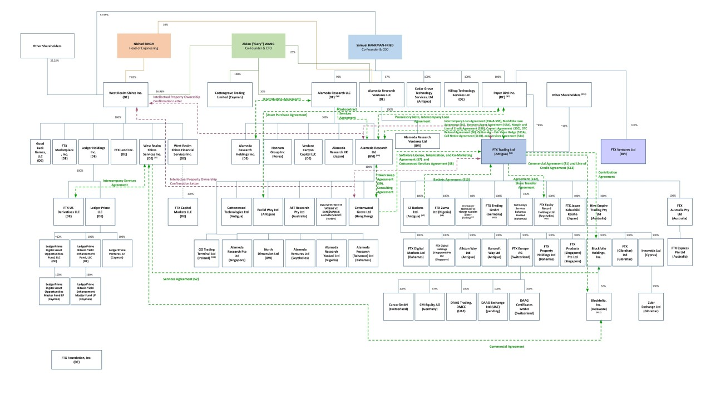

# FTX Background
[FTX](https://restructuring.ra.kroll.com/FTX/) was a "Cryptocurrency Derivatives Exchange, built by traders, for traders." according to the company website. But this exchange collapsed in a bad way; withdrawals ceased, bankruptcy filings, billions of dollars gone practically overnight. Details are still coming to the surface but here are some known high-level details. For clarity, FTX is based in the Bahamas and serves non-US residents; US residents can only trade with the FTX US affiliate. Both have overlapping management teams but separate capital structures. Both are now filing for bankruptcy:

Sam Bankman-Fried (SBF) started and owns two primary businesses ([dozens of businesses actually](https://www.ft.com/content/c28e0570-d4c4-433c-b0a0-c99fba613822)); Alameda Research which is a trading firm, and FTX which is an exchange. The red flag here is running both a business that takes trades and a business that makes the market is a conflict of interests. A rough analogy would be like owning a farmer's market where vendors pay you a small fee for each transaction they make selling their goods. To ensure the vendors can make lots of transactions, you spin up another company that goes to the farmer's market and always buys the goods.

This is how the FTX exchange was able to present itself as though the exchange had deep liquidity, Alameda was taking the other side of the trades. The problem is that the valuation of FTX was propped up by the appearance of deep liquidity, users could always count on executing trades on FTX, which was seen as valuable to venture capital firms looking to gain exposure to the cryptocurrency industry. Sophisticated marketing campaigns with celebrities like [Tom Brady](https://twitter.com/TomBrady) lured in droves of people looking to trade cryptocurrencies. More user's meant more venture capital interest and it didn't take long for FTX to reach a $32 billion dollar valuation in January 2022 with investments from companies like [Soft Bank](https://www.softbank.jp/en/), [Sequoia Capital](https://www.sequoiacap.com/), & [The Ontario Teachers Pension Plan](https://www.otpp.com/en-ca/).

Watch this FTX commercial as an example:  

Because FTX was raising so much capital, Alameda could not stop taking trades - they had to continue taking bad trades and losing more and more money because if they stopped then all the liquidity on FTX would dry up. Eventually Alameda had taken so many bad trades and lost so much money that the massive hole in their balance sheet could no longer be ignored. [Ian Allison](https://twitter.com/IanAllison123) of CoinDesk broke the story on November 2, 2022 with [this article](https://www.coindesk.com/business/2022/11/02/divisions-in-sam-bankman-frieds-crypto-empire-blur-on-his-trading-titan-alamedas-balance-sheet/), which exposes that Alameda had $14.6 billion dollars in assets and $8 billion dollars in liabilities, much of which on both sides were just worthless tokens created by FTX. 

This is where the story starts getting insane; the largest asset on Alameda's books is $3.66 billion dollars worth of "unlocked FTT" and the third largest asset is $2.16 billion dollars worth of "FTT collateral". Air-dropped FTT is being used as an asset and a liability on their books, $292 million dollars worth of "locked FTT" on the liabilities side along with an additional $7.4 billion dollars worth of loans. 

FTT is the token FTX created out of thin air so traders could save on trading fees. FTT is the equivalent of a [Chuck-E-Cheese gaming token](https://duckduckgo.com/?q=chucky+cheese+gaming+token&iax=images&ia=images). The basic idea is that traders on FTX can save a tiered percentage on trading fees based on how much FTT they hold and the duration it is held. FTX generated the FTT tokens and air-dropped them to Alameda, then FTX committed 30% of its revenue to buying the tokens back from Alameda. This created the appearance that FTT had some kind of value because the perception then became that the FTX exchange is doing very well and they are spending 30% of their revenue on FTT so that must be a smart money move. Alameda was using FTT to make loans and counting it as an over-valued asset when there was zero actual demand for it. 

Four days after CoinDesk exposed Alameda's balance sheet, CZ of [Binance](https://www.binance.com/en) took to Twitter and in four short tweets triggered market-wide pandemonium by announcing that Binance would be selling all of their FTT:

For comedic relief, this is probably the best analogy of what occurred here:

But the story starts getting weird...
