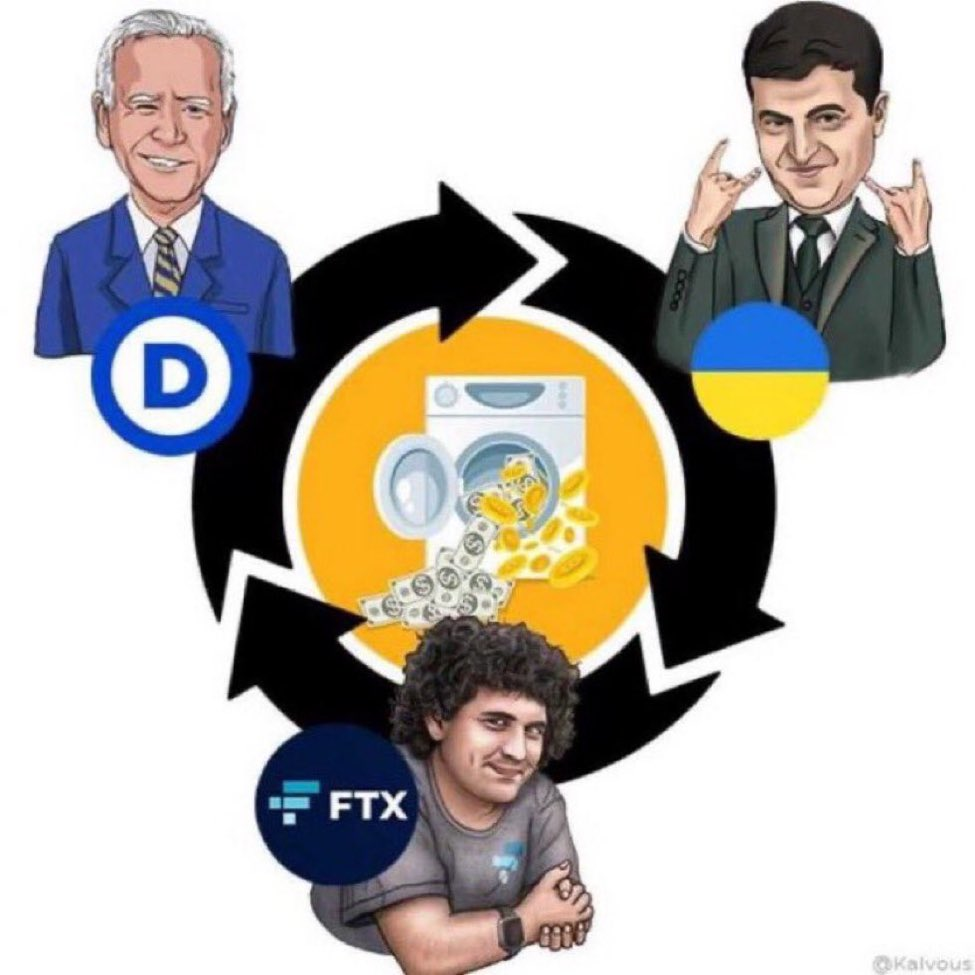
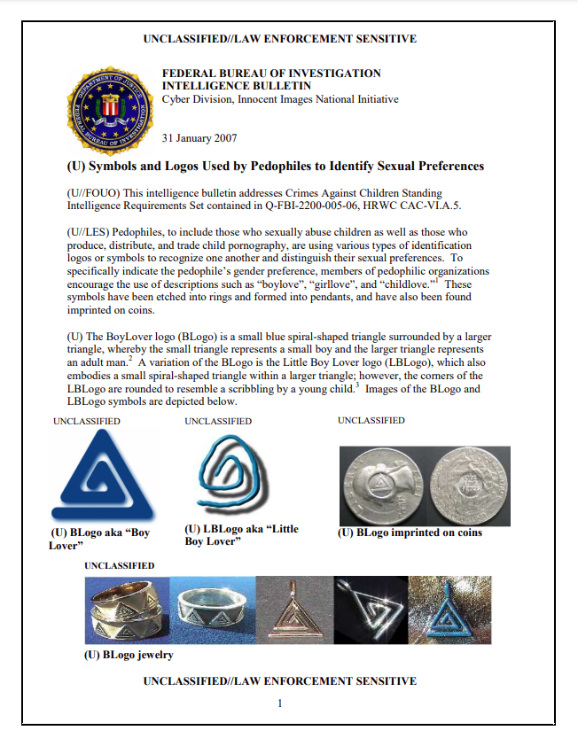
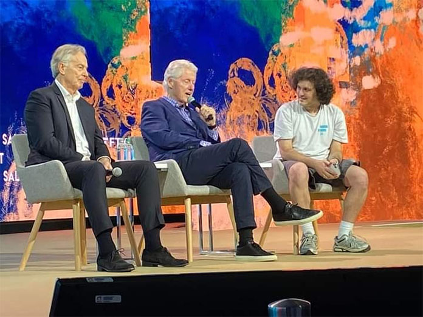

# FTX Conspiracy
There are so many questions in the wake of a scandal like this one and it is human nature to try and make sense out of chaos. Although it is impossible to confirm some of the information presented below, the purpose of including it is to provide some clues as to why this all happened and demonstrate the potential scale and reach of this scandal; even though most people will probably never know exactly what happened or get the closure they seek.

Details are now coming to light that indicate FTX used customer funds to plug the hole in Alameda's balance sheet. Since then, all hell has broke loose and there is no telling what is true and what is false at this point, but news headlines are all over the place and there is a mix of fact and fiction, for example: [Withdrawals from FTX have been frozen](https://twitter.com/WatcherGuru/status/1591145672085946368). [Bitcoin markets crashed](https://finance.yahoo.com/quote/BTC-USD/chart). [The FTX exchange was hacked](https://twitter.com/BTC_Archive/status/1591362107819560960). [The CEO took a private jet to Argentina](https://twitter.com/TheInsiderPaper/status/1591364301771902976). [The CEO was arrested in the Bahamas](https://www.forexlive.com/Cryptocurrency/reports-that-ftx-ceo-sam-bankman-fried-arrested-on-the-tarmac-at-airport-in-the-bahamas-20221110/). [SBF steps down as CEO](https://www.spokesman.com/stories/2022/nov/11/ftx-chief-sam-bankman-fried-resigns-as-firm-files-/). And probably the most logical explanation for it all; FTX was an elaborate money laundering service where US financial aid to Ukraine was washed through FTX and sent back to democrats in the US through campaign donations. Perpetuate war, send tax dollars to aid war torn country, invest aid money in cryptocurrency, receive campaign donations. What could possibly go wrong?

Image Credit: [@Kalvous](https://twitter.com/Kalvous/status/1591511301628788737)

There is another angle to all this that is starting to develop and it begs the question "Was FTX somehow involved as an elaborate sex trafficking ring cover too?". Here is a bizarre timeline of events that kind of make this whole thing look like a crime ring was disrupted, dismantled, and all the evidence destroyed and books were cooked. 

In what appears to be an [FBI Intelligence Bulletin](http://whale.to/c/FBI-pedophile-symbols.pdf) (although an official FBI source could not be found for this document), several symbols are identified as being used by pedophiles to signify their twisted sexual preferences. 

Two of the symbols identified in this document and other places on the web have striking similarities to symbols used by both Alameda and SBF:

*April 2020* - Joe Biden [announces](https://www.cnn.com/2019/04/25/politics/joe-biden-2020-president/index.html) his candidacy for president. Obviously, there are close ties to the Clintons who are known to have close ties with Epstein who operated a high-profile child sex trafficking ring. There has also been [damning evidence](https://twitter.com/TuckerCarlson/status/1547242777993482241) about Joe Biden and pedophilia brought to light from Hunter Biden's leaked laptop and cell phone data as well as [Ashley Biden's diary](https://www.msn.com/en-us/lifestyle/lifestyle-buzz/alleged-showers-with-my-dad-president-joe-bidens-daughter-reportedly-writes-of-alleged-abuse-in-diary/ar-AAYCrGi).

*June 2020* - The FTX US entity is [formed](https://apps.ilsos.gov/corporatellc/CorporateLlcController). The timing of the formation of FTX US is suspect because of the close proximity to Joe Biden's campaign announcement and the overwhelming quick success of FTX US and the amount of donations made to Joe Biden and the democratic party by FTX.

*November 2020* - FTX US & Alameda donate a combined $11,460,000 dollars to the Joe Biden presidential campaign. Apparently, Linda Fried is SBF's aunt and she is the head of Mind The Gap, she is a member of the WEF Global Agenda Council, and she is a scientist in epidemiology. Additionally, SBF as an individual donated $39.8 million dollars to the democratic party. 

*April 2022* - SBF, Bill Clinton, & Tony Blair [headline](https://www.bahamaspress.com/blair-and-clinton-address-crypto-bahamas-conference/) the Nassau cryptocurrency conference. 

*October 28, 2022* - Nikolai Mushegian, an early [Maker DAO](https://makerdao.com/en/) developer, posted this cryptic tweet:

